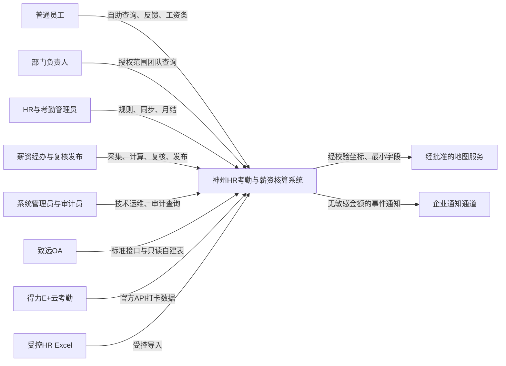
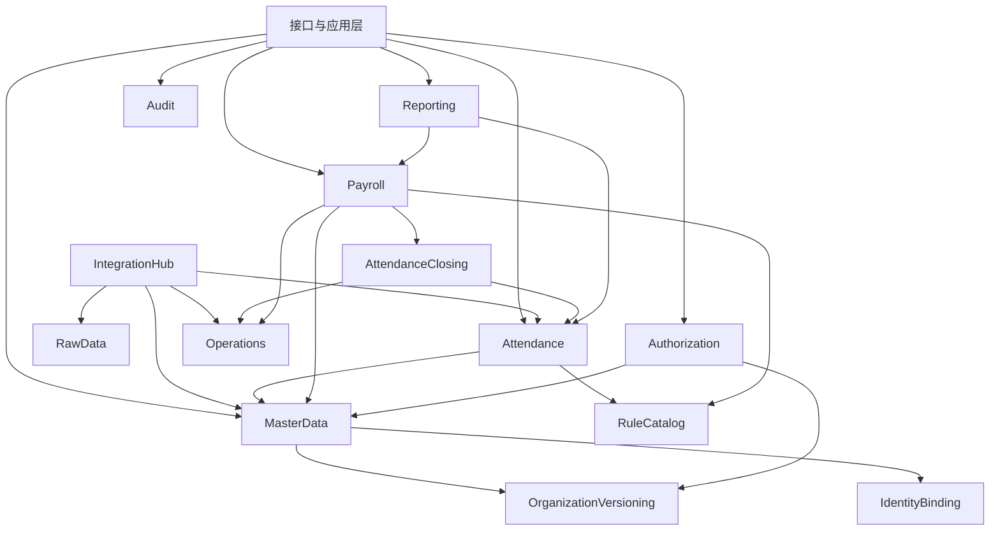
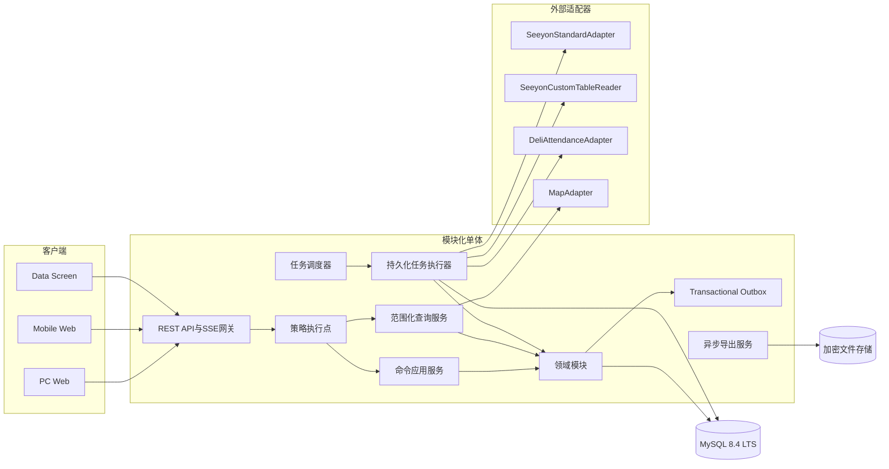
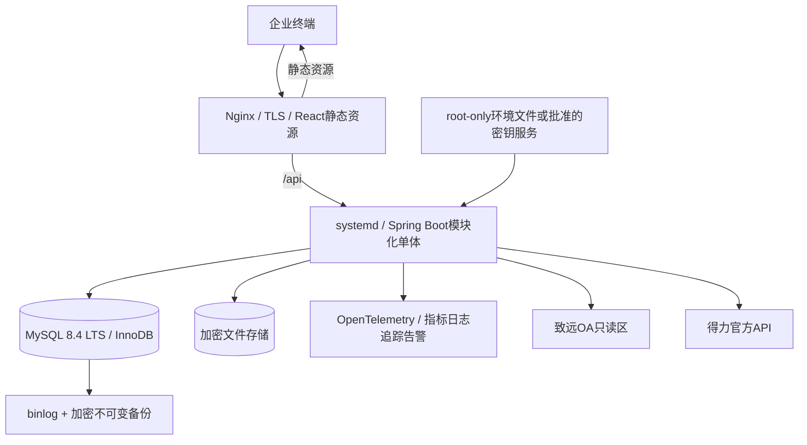
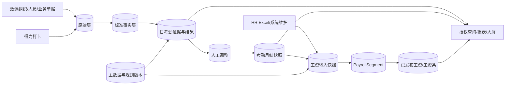
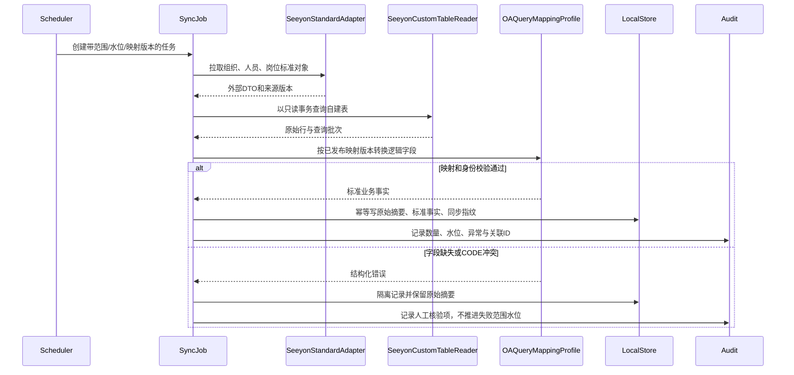
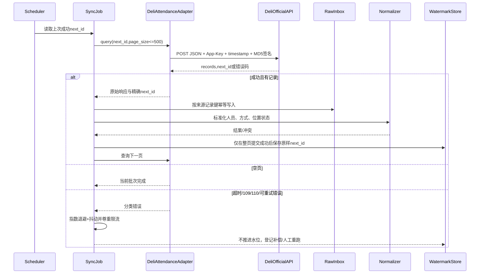
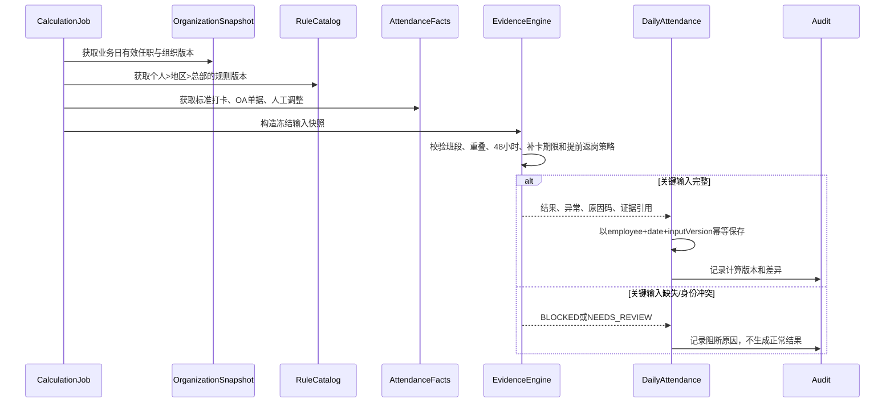
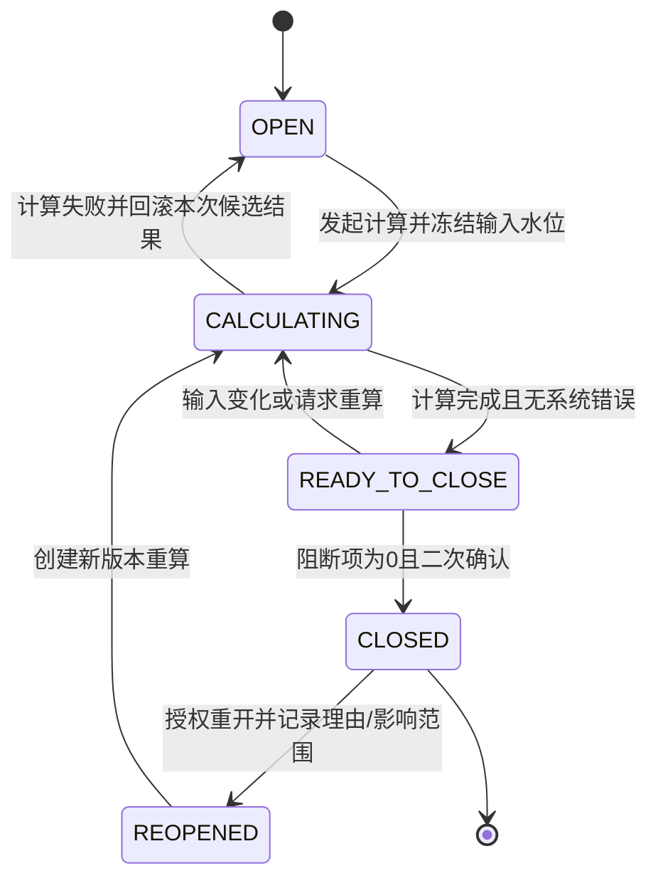
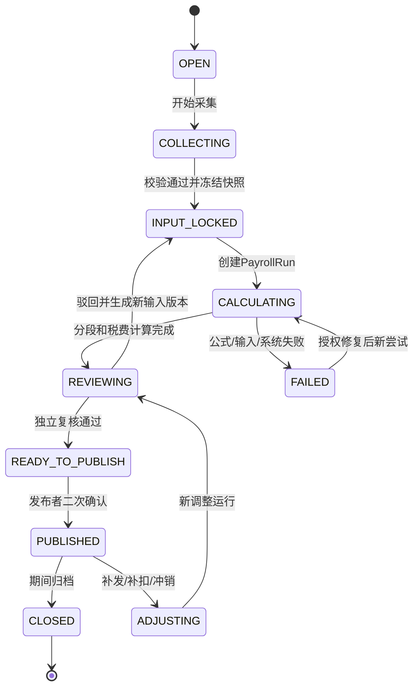

# 总体架构、流程与状态机

## 1. 架构原则

- 首期为模块化单体：一个部署单元内以领域模块和公开端口隔离，事务不跨模块直接写表。
- 依赖单向：`Interface → Application → Domain ← Infrastructure`；外部适配器实现领域端口，外部 DTO 不进入领域模型。
- 查询已同步数据不依赖外部系统在线；同步、计算、月结和工资运行由持久化任务驱动。
- 同步写原始层和标准层、计算写结果层、人工动作写调整层、月结/发布写不可变快照；禁止反向覆盖。
- 敏感能力默认拒绝，鉴权在服务端应用服务入口、仓储查询范围、序列化字段、导出/附件/消息通道重复收口。

## 2. 系统上下文图

信任边界：浏览器/移动端、外部系统、地图/通知、内部应用和数据存储分别独立；所有跨边界调用都需认证、超时、审计和字段最小化。

## 3. 领域模块图

依赖说明：`Payroll` 只消费已冻结的考勤月结与主数据快照，不查询考勤可变表；`Reporting` 只能通过各模块只读公开模型；`Authorization` 使用组织投影和历史范围但不能改写主数据；`Audit` 由 Outbox 订阅关键事件并形成受保护链。

## 4. 组件架构图

事务边界：一个命令只修改一个领域聚合并同时写 Outbox；跨模块流程由持久化任务/领域事件推进。工资发布、月结关闭和组织正式版本创建使用数据库事务、乐观锁和唯一业务键；外部 API 不参与本地事务。

## 5. 部署架构图

首版部署在 Ubuntu Server 24.04 LTS：Nginx 托管 React 静态资源并把 `/api` 反向代理至仅监听回环地址的 Spring Boot 可执行 JAR，JAR 由 `systemd` 托管。调度、任务租约、幂等键和 Outbox 均持久化在 MySQL，不引入 Redis、消息队列、Docker 或 Kubernetes。开发、测试、预发布、生产使用独立数据库、文件存储、账号、密钥命名空间和日志索引；生产出站只允许批准域名/IP。前端静态资源不包含密钥；正式 Logo 从版本化本地资源发布，不远程热链。

## 6. 核心数据流图

每条箭头均保留 `source_id/batch_id/input_snapshot_id/rule_version_id/correlation_id` 中适用字段。报表和大屏只读本地投影，外部故障不会阻断已同步数据查询。

## 7. 致远同步时序图

安全约束：`SeeyonCustomTableReader` 使用独立只读账号、查询超时、允许表/视图清单和 SQL 模板签名；应用不提供任意 SQL 输入，不执行写语句、DDL 或存储过程。

## 8. 得力同步时序图

初始化接口只在首次建水位时受控执行；`next_id` 不做加一、不假设连续。禁止调用删除员工或会删除历史打卡的接口。

## 9. 日考勤计算时序图

## 10. 考勤月结状态机

守卫条件：`CLOSED` 前必须锁定范围、规则版本、输入水位、覆盖人数和未决异常；重开不删除旧月结，生成新版本及逐员工差异。

## 11. 工资核算与发布状态机

发布守卫：运行输入快照、考勤月结、规则版本和分段均冻结；经办与复核/发布职责分离；发布前重新计算授权；`PUBLISHED` 数据不可 `UPDATE`，调整通过新 `PayrollRun`/记录体现。

## 12. 同步与异步边界

| 操作 | 执行方式 | 用户反馈 | 幂等/并发控制 |
|---|---|---|---|
| 列表、详情、权限预览、已同步报表 | 同步 | 目标 P95 见 NFR；返回数据版本和更新时间 | 范围化查询，不依赖外部在线 |
| 保存规则草稿、反馈提交、授权变更 | 同步事务 | 成功/失败及审计 ID | 乐观锁、请求幂等键 |
| 组织/打卡/OA 同步 | 异步任务 | 任务 ID、进度、部分成功、可重跑 | 业务唯一键、页提交、水位 CAS |
| 日计算、月结、工资计算/重算 | 异步任务 | 状态机、阻断项、差异 | 输入快照 ID + 运行版本唯一 |
| 批量导出 | 异步 | 进度、取消、一次性下载 | 授权快照 + 请求指纹 |
| 工资发布、月结关闭、重开 | 同步命令触发异步收尾 | 二次确认后返回运行 ID | 版本守卫、职责分离、不可变事件 |

## 13. 未来拆分触发条件

只有满足以下一项并经数据证明后才考虑拆服务：某模块需要独立扩缩容且持续占用总资源 40% 以上；发布节奏/合规隔离要求无法由模块与进程隔离满足；单模块故障持续影响核心 SLA；团队已具备独立 on-call 和数据所有权。优先候选是集成任务、异步导出或工资隔离区；拆分前必须通过 POC 验证分布式事务、审计链和权限上下文传递。
