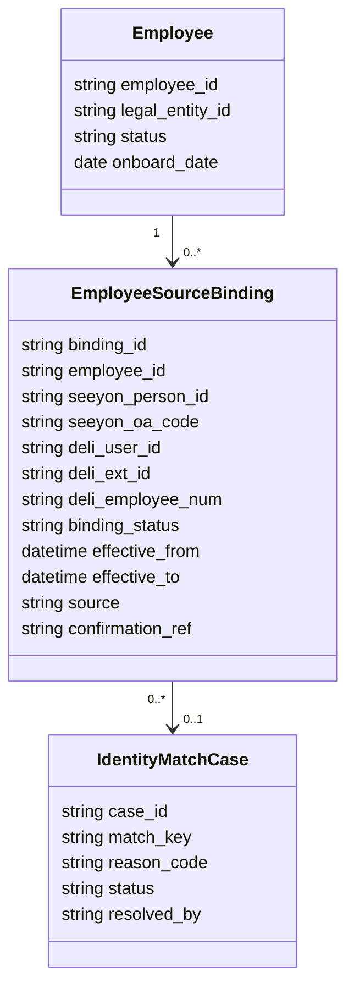
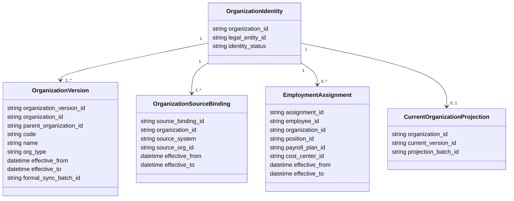
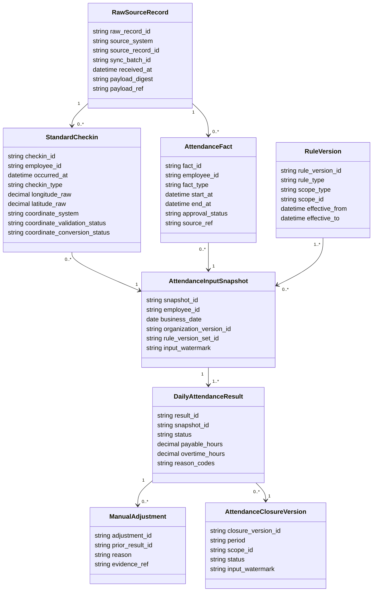
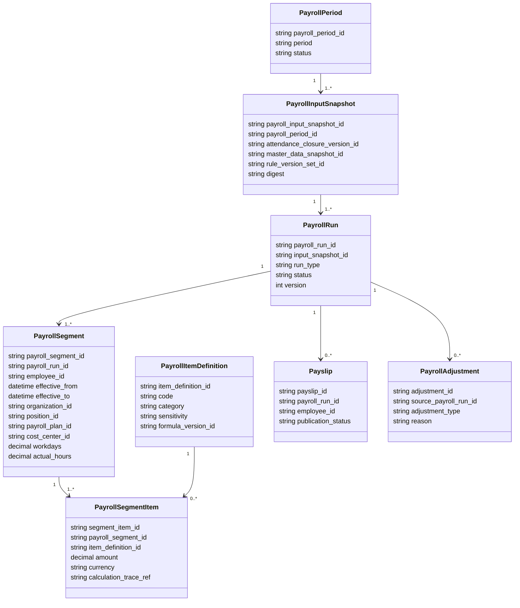
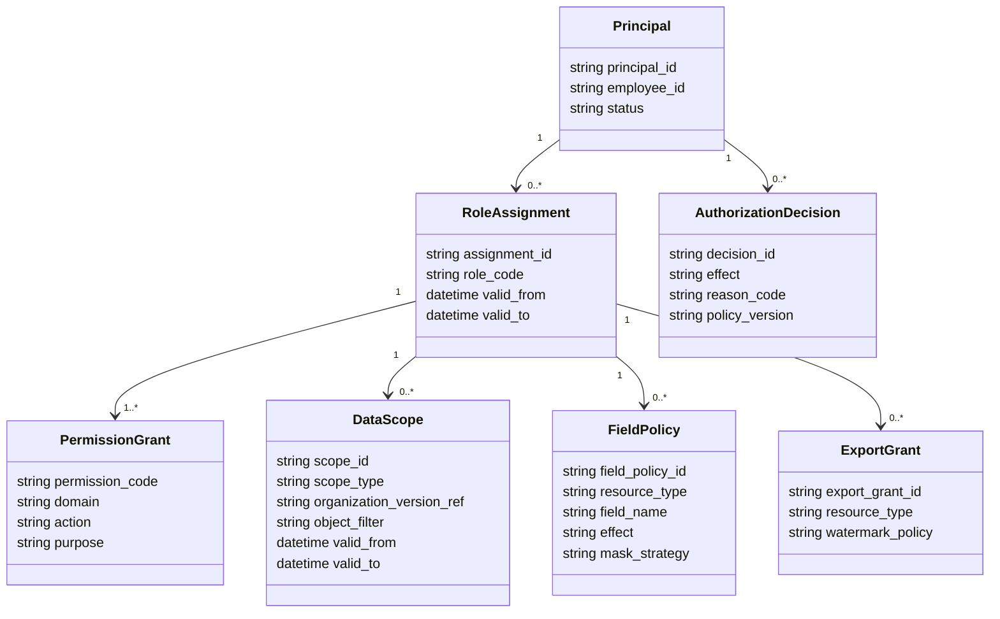
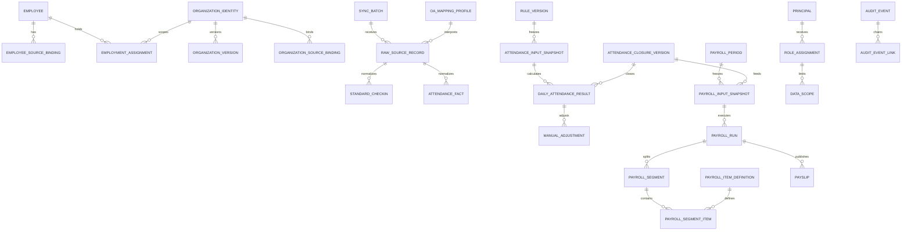

# 核心领域模型与数据库逻辑模型

## 1. 建模约定

- 内部 ID 使用不可枚举 UUID/ULID；外部 ID 用 `varchar` 保存原文，API 类型为 `string`。
- 有效期统一为半开区间 `[effective_from, effective_to)`；`effective_to = null` 表示当前有效。
- 金额用定点十进制并带币种；工时/天数用定点十进制；时间存 UTC 瞬时并另存业务时区/业务日期。
- 原始负载可加密保存或只保留受控对象存储引用；普通日志只记录摘要、分类和关联 ID。
- 所有可配置规则均有 `draft/published/retired` 生命周期、版本号、生效期、发布人与审计事件。

## 2. 员工身份绑定模型

`EmployeeSourceBinding` 唯一性约束按来源和有效期执行；CODE 缺失、重复、变化或得力字段冲突时，绑定状态为 `NEEDS_REVIEW`，相关记录保留在原始层但不自动归属。解除或更换绑定只关闭旧有效期并新增记录，不能重写历史事实的 `employee_id`。

## 3. 组织身份、版本和任职历史模型

自动同步刷新当前投影并保留批次、指纹、计数和异常；管理员执行“组织架构变更同步”时把差异集固化为正式版本。拆分、合并或来源 ID 复用通过新身份/绑定和变更关系表达，不复用旧身份。历史查询以业务发生时间解析有效版本。

## 4. 考勤领域模型

位置模型必须保存经度、纬度、位置名称、打卡方式、原始坐标字符串、坐标系、校验状态、转换状态和来源。坐标系为 `UNKNOWN`、缺失、越界或未验证时，接口返回状态和原始证据，但地图层不得产生定位点。

## 5. 工资分段和工资项目模型

分段边界取任职、岗位、工资方案、成本归属或计薪口径的有效期并集。实际工作日和实际工时是两种显式计薪基数，公式不得混用。员工月中从销售部调至采购部时，调动生效日归新部门，两个分段分别展示工作日/工时、项目金额和成本，分段之和与员工期间金额严格相等。

## 6. 权限与数据范围模型

最终允许集合是身份状态、RBAC、组织范围、对象关系、字段、目的、时间、操作和导出权限的交集；任一缺失即拒绝。策略预览使用同一决策引擎但仅返回解释，不签发可用于真实请求的授权。

## 7. 数据库逻辑 ER 图

## 8. 核心实体定义与唯一约束

| 实体 | 含义 | 关键唯一/检查约束 |
|---|---|---|
| `Employee` | 永久员工身份 | `employee_id` 不可变；不以工号为主键 |
| `EmployeeSourceBinding` | 员工与来源身份的带时态绑定 | 同来源外部 ID 的有效期不得重叠；冲突不激活 |
| `OrganizationIdentity` | 不随名称/编码变化的组织身份 | 法人范围内不可复用 |
| `OrganizationVersion` | 某时间段有效的组织属性 | 同组织版本有效期不重叠；父级不得形成环 |
| `OAQueryMappingProfile` | 自建表物理字段到逻辑契约的发布版本 | 同业务类型同生效时点仅一个发布版本 |
| `RawSourceRecord` | 不可变来源证据 | `(source_system, source_record_id, source_revision)` 唯一 |
| `SyncWatermark` | 外部增量读取位置 | 按租户/接口/范围唯一，CAS 更新，不做算术 |
| `DailyAttendanceResult` | 某快照下的日计算版本 | `(employee_id, date, snapshot_id, algorithm_version)` 唯一 |
| `AttendanceClosureVersion` | 月结冻结版本 | 同范围/期间仅一个当前关闭版本；旧版本保留 |
| `PayrollInputSnapshot` | 工资计算所有输入的冻结引用 | 内容摘要不可变 |
| `PayrollSegment` | 员工期间内同一归属/方案的有效段 | 同员工/运行内段不重叠、无空段 |
| `AuditEvent` | 安全和业务审计事件 | 追加写；包含前一事件哈希、事件哈希和签名/受保护存储证据 |

## 9. 数据生命周期

- 原始同步证据、月结、已发布工资、工资条和安全审计按企业合规策略长期保留；具体年限在上线前由法务/财务确认。
- 临时导出文件默认最长 24 小时，一次性链接默认 10 分钟；到期删除对象但保留不含敏感内容的导出审计。
- 缓存仅保存可重建、已授权且最小化的数据；工资金额不进入共享缓存或浏览器持久存储。
- 删除请求以法定保留和审计完整性为前提，优先停用/隔离/加密擦除，绝不级联删除历史考勤和工资事实。
