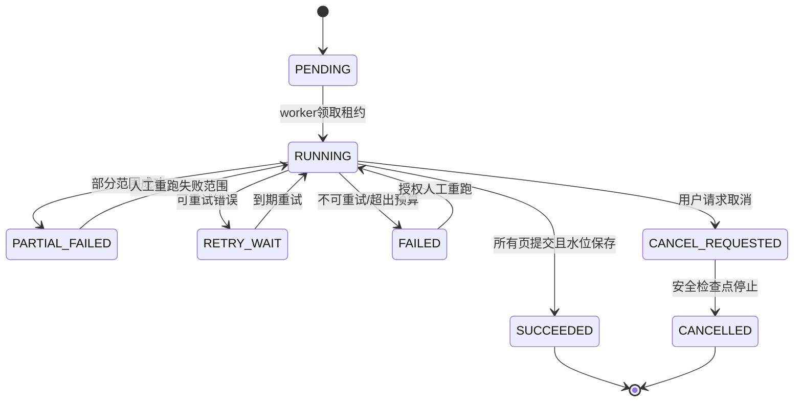

# 外部集成、可靠同步与 OpenAPI 契约规划

## 1. 官方资料核对结论

| 来源 | 已核对事实 | 本项目约束 |
|---|---|---|
| [致远数据字典说明](https://open.seeyon.com/book/ctp/dd.html) | 官方明确不建议直接操作数据库，关系复杂，应优先使用接口，数据字典仅供参考 | 标准组织/人员优先 `SeeyonStandardAdapter`；自建业务表仅由受限只读器查询 |
| [致远组织模型 REST](https://open.seeyon.com/book/ctp/restjie-kou/zu-zhi-mo-xing-guan-li.html) | 提供部门、岗位、组织等标准接口目录 | 具体版本、分页、启停状态和权限在联调样本中冻结 |
| [致远附件集成](https://open.seeyon.com/book/ctp/ji-cheng-chang-jing/attachment.html) | 附件存在上传/下载、病毒扫描、加解密与审计钩子 | 本项目只读下载；附件授权独立复算，不以附件 ID 可见代替内容可读 |
| V80 数据字典 | `ORG_MEMBER/ORG_UNIT/ORG_POST/ORG_RELATIONSHIP` 等标准对象 ID 为 `BIGINT`；`CTP_ATTACHMENT` 与 `CTP_FILE` 分离 | 外部 ID 全链路 `string`；不能把附件引用当文件内容；不推断自建表 |
| [得力 E+ OA 集成](https://doc.delicloud.com/v3/integration/oa.html) | 基址 `https://v2-api.delicloud.com`；POST JSON；请求头含 App-Key、13 位时间戳和基于 path/timestamp/key/secret 的小写 MD5；`page_size<=500`；`next_id` 非连续且须原样保存；错误 109 超时、110 限流；删除员工会删除打卡 | 签名封装在适配器；重试/限流分类；游标按页事务提交；绝不调用删除员工/历史打卡接口 |

外部文档中的字段名是适配器事实，不是领域字段。任何与真实租户返回不一致的地方必须登记为接口详细设计待联调，不以猜测补齐。

## 2. 端口与适配器

| 端口/适配器 | 责任 | 输入/输出 | 明确禁止 |
|---|---|---|---|
| `SeeyonStandardPort` / `SeeyonStandardAdapter` | 获取组织、人员、岗位及可用标准附件元数据 | 输入同步范围和水位；输出内部标准 DTO、来源版本、原始 ID 字符串 | 外部实体直达领域；任何 OA 写操作 |
| `SeeyonCustomTablePort` / `SeeyonCustomTableReader` | 通过批准模板只读查询假勤、调动等自建单据 | 输入映射配置、时间窗；输出原始行、查询摘要 | 任意 SQL、写语句、DDL、存储过程、根据 PRD 猜表字段 |
| `OAQueryMappingProfile` | 把物理字段映射到版本化逻辑契约 | 字段路径、类型、必填、转换、默认/枚举映射、有效期 | 领域模型引用物理列名；缺失关键字段时静默默认 |
| `DeliAttendancePort` / `DeliAttendanceAdapter` | 鉴权、初始化、精确游标分页、限流与错误归类 | 输入租户/精确 `next_id`；输出原始页、返回的 `next_id`、请求摘要 | `next_id+1`、按打卡时间假设顺序、破坏性删除接口 |
| `MapPort` / `MapAdapter` | 仅对已验证坐标进行展示转换 | 输入坐标系明确的最小坐标；输出带提供商/版本的转换结果 | 坐标系未知时调用/绘点；发送员工薪资等无关字段 |

## 3. `OAQueryMappingProfile` 逻辑契约

发布版本至少包含：`profile_id`、`business_type`、`source_view_allowlist_key`、`source_id_mapping`、`employee_code_mapping`、业务开始/结束/状态/审批字段映射、类型转换、时区、枚举映射、校验规则、内容摘要、`effective_from/to`、发布人和回滚目标。

逻辑业务类型包括请假、加班、外出、出差、补卡、销假/提前返岗、人事调动。物理表名和字段只存在受控部署配置/密钥化连接配置中；API、领域对象、审计消息和普通日志不包含 SQL 或凭据。映射发布前使用脱敏契约样本执行：必填字段、类型、19 位 ID、时间区间、审批状态和行数上限验证。

## 4. 可靠同步设计

### 4.1 任务状态机



### 4.2 机制

- **幂等键**：原始记录用来源系统、来源记录 ID、来源修订/载荷摘要；计算用员工、期间、输入快照、算法版本；命令使用调用方 `Idempotency-Key` 与主体/operation/request hash 绑定。
- **页提交**：原始页、标准化结果、异常和新水位在一个本地事务中提交；任一关键写失败，水位保持旧值。
- **游标**：得力官方把 `next_id` 定义为 JSON 整型；内部以十进制文本保存以避免 64 位溢出，只在 HTTP 协议边界使用任意精度整数编码，不自增、不计算大小，并按相等/已见集合阻断循环；致远按官方版本/时间窗加稳定 tie-breaker，具体在联调冻结。
- **去重**：来源唯一键先挡重复，业务疑似重复另标 `duplicate_candidate` 供人工核验，不擅自合并不同来源证据。
- **重试**：网络、109、110、5xx 使用有上限指数退避和抖动，遵守服务端限流；鉴权失败、映射错误、数据语义错误不盲重试。
- **补偿**：修复配置后按原范围/水位/映射版本创建新尝试，旧尝试与原始数据保留；补偿结果生成差异事件。
- **人工重跑**：必须输入原因和范围，显示将使用的水位、映射/适配器版本及预计影响；权限校验后二次确认。
- **租约**：任务实例有租约和心跳，超时可接管；提交前核对 fencing token，防止旧 worker 回写。

## 5. OpenAPI 全局规范

- 规范版本目标为 OpenAPI 3.1；契约先行，`docs_confirm` 后单独冻结。
- 基址：`/api/v1`；资源 ID 是不透明字符串。时间为 RFC 3339，业务日为 `YYYY-MM-DD`，金额为十进制字符串，禁止二进制浮点。
- 列表统一使用不透明游标 `page[after]` 和 `page[size]`，最大值由操作声明；不暴露内部连续 ID。
- 命令响应 `202` 返回 `operation_id/job_id`；同步小命令返回 `200/201`。创建/高风险命令接受 `Idempotency-Key`；并发更新接受 `If-Match`。
- 错误体固定为 `code`、`message`、`correlation_id`、`retryable`、可选字段错误；无权限对象统一 `404 RESOURCE_NOT_AVAILABLE` 或组织统一策略，不区分不存在与无权。
- 敏感响应含 `Cache-Control: no-store`；工资字段按授权白名单从序列化层省略，不先返回再掩码。
- 每个 operation 扩展声明：`x-permission-domain`、`x-action`、`x-data-scope`、`x-field-policy`、`x-audit-event`、`x-idempotency`。

## 6. API 契约目录

| API 族 | 代表性 operation | 方法/路径 | 权限与行为 |
|---|---|---|---|
| 会话与导航 | 获取本人能力和服务端菜单 | `GET /me/capabilities` | 返回最小权限视图；无工资能力不返回工资金额能力 |
| 组织 | 当前树、历史版本、变更对比 | `GET /organization-units`；`GET /organization-versions/{id}`；`GET /organization-changes/{id}` | `MASTER_DATA` + 组织范围；外部 ID 为 string |
| 组织同步 | 预览、创建正式版本 | `POST /organization-syncs/preview`；`POST /organization-syncs` | HR/系统管理员分权；二次确认；异步 |
| 人员绑定 | 查询冲突、确认绑定 | `GET /source-binding-cases`；`POST /source-binding-cases/{id}/resolve` | 对象权限；历史只增不改 |
| 集成配置 | 映射版本查看/发布 | `GET /oa-mapping-profiles`；`POST /oa-mapping-profiles/{id}/publish` | 不返回连接密钥；发布需双人复核建议 |
| 同步任务 | 发起、取消、重跑、查看 | `POST /sync-jobs`；`POST /sync-jobs/{id}/cancel`；`POST /sync-jobs/{id}/rerun`；`GET /sync-jobs/{id}` | 操作权限、范围和原因；实时订阅再次鉴权 |
| 原始数据 | 按批次/来源查询 | `GET /raw-records`；`GET /raw-records/{id}` | 默认隐藏敏感 payload；仅审计/集成排障角色 |
| 规则班次 | 草稿、比较、发布 | `GET/POST /attendance-rules`；`POST /attendance-rules/{id}/publish`；`GET /shifts` | 有效期冲突失败；发布审计 |
| 日考勤 | 列表、详情、证据、重算 | `GET /attendance-days`；`GET /attendance-days/{id}`；`GET /attendance-days/{id}/evidence`；`POST /attendance-calculations` | 本人/组织范围；异步重算 |
| 异常反馈 | 提交、处理、时间线 | `POST /attendance-exceptions/{id}/feedback`；`GET /feedback-cases/{id}`；`POST /feedback-cases/{id}/resolve` | 员工仅本人；负责人仅授权范围 |
| 位置 | 获取受控位置视图 | `GET /checkins/{id}/location` | 独立对象/字段权限；未验证不返回可绘点坐标 |
| 报表大屏 | 日月报、聚合大屏 | `GET /attendance-reports/daily`；`GET /attendance-reports/monthly`；`GET /screen/attendance` | 查询范围服务端注入；大屏仅聚合且小组抑制 |
| 月结 | 预检、创建、关闭、重开、重算 | `POST /attendance-closures/preflight`；`POST /attendance-closures`；`POST /attendance-closures/{id}/close`；`/reopen`；`/recalculate` | 阻断守卫、二次确认、异步运行 |
| 年假制度 | 本人余额、制度 | `GET /me/leave-balances`；`GET /policies` | 本人或授权范围；版本可追溯 |
| 工资采集 | 上传会话、校验、锁定 | `POST /payroll-input-batches`；`GET /payroll-input-batches/{id}/errors`；`POST /payroll-input-snapshots` | `PAYROLL` 独立域；文件扫描、模板版本、字段加密 |
| 工资配置 | 项目、方案、法定规则版本 | `GET/POST /payroll-items`；`GET/POST /payroll-plans`；`GET/POST /statutory-rule-versions` | 字段权限和职责分离 |
| 工资运行 | 计算、详情、分段、复核、发布 | `POST /payroll-runs`；`GET /payroll-runs/{id}`；`GET /payroll-runs/{id}/segments`；`POST /payroll-runs/{id}/review`；`POST /payroll-runs/{id}/publish` | 输入冻结；复核/发布人与经办分离；发布前再授权 |
| 工资调整 | 补发补扣/冲销 | `POST /payroll-adjustments` | 只新增新运行，引用原发布记录 |
| 工资条 | 本人/受权查看 | `POST /payslips/{id}/reveal`；`GET /me/payslips/{id}` | 金额默认隐藏；近期登录；查看审计；`no-store` |
| 权限 | 角色、范围、字段、预览 | `GET/POST /permission-policies`；`POST /permission-previews` | 权限管理员不能自授工资读取；预览不产生授权令牌 |
| 导出 | 创建、状态、下载 | `POST /exports`；`GET /exports/{id}`；`POST /exports/{id}/download-token` | 创建/生成/下载三阶段复算；水印；一次性短链 |
| 审计 | 条件查询、完整性验证 | `GET /audit-events`；`POST /audit-integrity-checks` | 审计只读；工资审计字段脱敏 |
| 系统运维 | 健康、任务、告警 | `GET /health/ready`；`GET /operations/jobs`；`GET /alerts` | 技术权限不授予业务数据查看 |

## 7. 关键 schema 约束

```yaml
ExternalPreciseId:
  type: string
  minLength: 1
  description: 外部系统精确标识；禁止转为 JavaScript Number
Money:
  type: string
  pattern: '^-?[0-9]+(\\.[0-9]{1,4})?$'
CoordinateEvidence:
  required: [validation_status, conversion_status, source]
  properties:
    longitude_raw: { type: [string, 'null'] }
    latitude_raw: { type: [string, 'null'] }
    coordinate_system: { enum: [WGS84, GCJ02, BD09, UNKNOWN] }
    validation_status: { enum: [VALID, MISSING, OUT_OF_RANGE, UNCONFIRMED] }
    conversion_status: { enum: [NOT_REQUIRED, CONVERTED, NOT_ATTEMPTED, FAILED] }
    map_point_available: { type: boolean }
PayrollAmountField:
  type: string
  writeOnly: false
  description: 仅当字段策略允许时才存在于响应，不允许用null或掩码代替未授权字段省略
```

## 8. 契约验证点

1. 以 `9223372036854775807` 和更长示例通过 schema、服务、数据库、JSON 和浏览器序列化往返，字节级相同。
2. 生成服务端/客户端类型后执行契约测试，禁止将 `ExternalPreciseId` 生成为 JS `number`。
3. 每个路由执行角色×范围×对象×字段×操作的负向测试；列表、搜索、聚合、导出、附件、地图和 SSE 单独覆盖。
4. 得力适配契约测试使用官方字段结构的合成数据；模拟服务仅证明适配逻辑，不作为正式集成完成证据。
5. 致远自建表映射在联调环境以脱敏样本验证；任何物理字段变化通过新 profile 版本处理。
6. OpenAPI diff 阻止未评审的破坏性变更；前后端构建都校验同一冻结契约哈希。

## 9. 联调前置与禁止动作

真实连接参数尚未提供时，只允许显式标记的开发适配器和合成数据。凭据只通过环境变量或密钥管理服务注入，文档和仓库仅记录变量名/状态。未经授权不探测内网、不访问生产员工/考勤/工资数据、不调用致远写接口或得力破坏性接口。
