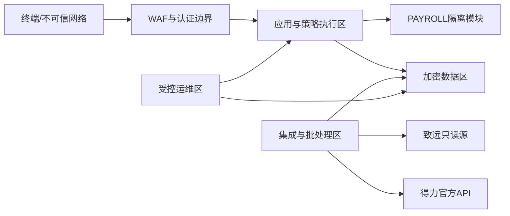
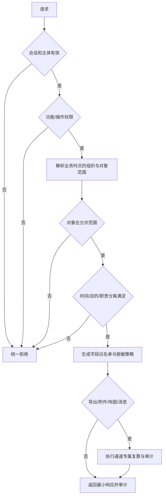

# 安全威胁模型、权限矩阵与审计方案

## 1. 安全目标与分类

安全原则是默认拒绝、最小权限、服务端强制、失败关闭、职责分离、可追溯。P0 不强制 MFA，但工资高风险操作要求近期登录，认证架构保留 WebAuthn/OIDC `acr/amr` 强认证扩展点。

| 级别 | 示例 | 存储/传输 | 日志/客户端 |
|---|---|---|---|
| S4 极敏感 | 工资、个税、个人成本、身份证明 | TLS；字段/列级信封加密或等效保护；密钥分离与轮换 | 禁止 URL、普通日志、错误堆栈、Web Storage、浏览器缓存；响应 `no-store` |
| S3 敏感 | 精确位置、考勤证据、请假原因、附件 | TLS；加密存储；对象级权限 | 仅记录摘要和关联 ID；按目的和字段最小返回 |
| S2 内部 | 组织、岗位、聚合报表 | TLS；访问控制 | 允许受控缓存，仍按组织范围 |
| S1 公开品牌 | 企业名称、已确认 Logo | 完整性保护 | 可公开分发；生产只用本地版本化资源 |

## 2. 信任边界与资产

关键资产：员工身份绑定、组织历史、原始打卡与位置、假勤附件、月结快照、工资输入/结果/工资条、权限策略、密钥、审计链、备份。主要对手包括外部攻击者、普通员工、越权主管、被攻陷终端、恶意/误操作管理员、供应链和外部系统故障。

## 3. 威胁模型与控制

| ID | 威胁/路径 | 预防 | 检测/响应 | 验证 |
|---|---|---|---|---|
| T01 | 修改 URL、employee_id、organization_id 读取他人记录（BOLA/IDOR） | 不透明 ID；服务端从主体与组织版本求范围；仓储强制 scope predicate | 拒绝决策与异常枚举速率告警 | 每类详情/列表/搜索做跨员工和跨部门负测 |
| T02 | 通过聚合/搜索推断无权对象 | 聚合前过滤；小组阈值默认 5；互补抑制；统一错误 | 高维反复查询检测 | 单元格差分和多筛选组合测试 |
| T03 | 前端隐藏失效、抓包修改请求 | 服务端操作权限和字段白名单；客户端仅改善体验 | 授权拒绝率、异常参数审计 | 直接 HTTP 请求不依赖 UI |
| T04 | 系统管理员读取工资 | 技术角色不含 PAYROLL；数据密钥/数据库访问 JIT；权限管理员不能自授 | 工资查询/导出全审计，职责冲突告警 | 系统管理员对所有工资 route 均拒绝 |
| T05 | 工资经办自审自发 | maker/reviewer/publisher 分离；运行记录主体；策略守卫 | 同主体冲突告警 | 同一主体复核/发布返回拒绝 |
| T06 | 越权导出/下载/附件 | 创建、生成、下载三阶段复算；一次性 token；水印；附件独立对象授权 | 大量/异常时段导出告警 | 撤权后旧链接失效；跨对象附件拒绝 |
| T07 | 重放高风险命令 | 会话绑定、CSRF 防护、`Idempotency-Key`、请求 hash、短时 nonce/版本守卫 | 重复键冲突与速率异常 | 重放月结/发布/导出不产生第二结果 |
| T08 | 19 位 ID 精度丢失造成错绑/越权 | 全链路字符串；schema/codegen 禁止 number | 契约验证失败阻断发布 | 最大/超最大 64 位样本往返 |
| T09 | 得力重复、乱序、限流/超时 | 原始唯一键、精确游标、页事务、退避和并发上限 | 水位年龄、重复率、109/110 告警 | 同页重放、进程崩溃、乱序样本 |
| T10 | OA SQL 注入或误写生产 | 固定查询模板/allowlist；只读账号；数据库层拒绝写；超时/行数限制 | 数据库审计和写尝试告警 | INSERT/UPDATE/DELETE/DDL/存储过程权限测试 |
| T11 | 坐标系错误导致虚假位置 | 保存原始/系统/校验/转换状态；未知不转换不绘点 | 未确认占比监控 | 缺失、越界、UNKNOWN 均无地图点 |
| T12 | Excel 公式注入、恶意文件或越权覆盖 | 类型/模板/大小限制；病毒扫描；公式和外链禁用；暂存后校验；输入冻结 | 扫描失败与模板偏差审计 | `=`, `+`, `-`, `@` 开头和宏文件拒绝/转义 |
| T13 | 日志、错误、浏览器缓存泄漏 | S4/S3 日志拦截器；错误统一；`no-store`；禁止 Web Storage | DLP/日志扫描、前端存储测试 | 工资/个税关键字与样本不出现在产物 |
| T14 | 密钥或连接串入库 | KMS/密钥服务；secret scanning；环境隔离；短期凭据 | 仓库和镜像扫描 | 构建对高熵/已知模式零容忍 |
| T15 | 审计记录被篡改/删除 | 追加写、前向哈希链、周期签名锚、受保护副本和职责分离 | 定时完整性验证；失败 P1 | 修改/删除测试能定位断点 |
| T16 | 数据库管理员越权 | JIT、双人批准、工单范围、会话录制、字段加密密钥分离 | break-glass 和大查询告警 | 无工单普通 DBA 不能解密工资 |
| T17 | 实时消息越权订阅 | 握手和每 topic 鉴权；权限变更后撤销；事件只含最小元数据 | 订阅拒绝与撤权延迟指标 | 修改 topic/organization 订阅拒绝 |
| T18 | 供应链或依赖漏洞 | 锁文件、签名构建、SBOM、依赖/镜像扫描、最小基础镜像 | CVE SLA 和阻断策略 | 高危可利用漏洞未豁免不得发布 |
| T19 | 外部系统故障拖垮在线业务 | worker 隔离、超时、熔断、资源池和本地查询 | 外部错误与在线 SLI 分开告警 | 外部断网时已同步查询仍可用 |
| T20 | 备份泄漏或不可恢复 | 加密、独立账号/域、不可变保留、恢复审计 | 备份年龄/完整性告警 | 季度隔离恢复与授权检查 |

## 4. 授权决策流程

策略服务不可用、组织范围版本缺失、字段策略解析失败或审计前置不可用时，高敏操作失败关闭。权限撤销目标在 5 分钟内传播至会话、缓存、下载 token 和实时订阅。

## 5. 角色权限矩阵

`R`=读取，`W`=配置/处理，`X`=导出，`P`=复核/发布，`A`=技术管理，`—`=默认拒绝。所有符号仍需与组织、对象、字段、时间、目的和操作范围求交。

| 资源 | 老板/最高管理者 | HR 管理员 | 考勤管理员 | 薪资管理员/经办 | 部门负责人 | 普通员工 | 系统管理员 | 审计/只读 |
|---|---|---|---|---|---|---|---|---|
| 组织当前/历史 | R | RW | R | R最小 | R授权组织 | R本人关联 | A元数据 | R |
| 人员身份绑定 | R汇总 | RW | R/处理考勤冲突 | R最小 | R授权组织最小 | R本人 | A任务、不读敏感 | R审计 |
| OA/得力原始数据 | R汇总 | R | RW | — | R受限证据 | R本人证据 | A技术摘要 | R受控 |
| 考勤规则/班次 | R | RW | RW | R | R | R适用规则 | A发布基础设施 | R |
| 考勤明细/异常 | R授权范围 | RWX | RWX | R冻结输入 | R授权组织 | RW本人反馈 | A、不读业务明细 | R授权 |
| 地图位置 | R授权且字段许可 | R授权 | R授权 | — | R授权且必要 | R本人 | — | R受控 |
| 月结 | R | RW | RWP | R输入 | R状态 | R本人结果 | A任务 | R |
| 工资配置/采集 | R授权 | 仅单独授权 | — | RW | — | — | — | R受控 |
| 工资明细/分段 | R授权 | 仅单独 PAYROLL 授权 | — | RW | 默认— | R本人已发布且受控 | — | R脱敏/受控 |
| 工资复核/发布 | 仅明确授予 P | — | — | 经办与复核/发布互斥 | — | — | A流程、不含业务权 | R审计 |
| 工资条 | 可按授权范围 | 仅单独授权 | — | R工作所需 | — | R本人 | — | R访问审计 |
| 权限管理 | 查看本人范围 | 业务角色建议 | — | — | — | — | A非工资业务权 | R |
| PAYROLL 授权管理 | — | — | — | — | — | — | 仅技术配置不可自授/读取 | R变更审计；专职权限管理员执行 |
| 系统任务/监控 | R | R业务任务 | R考勤任务 | R工资任务状态无金额 | R状态 | — | A | R |

工资复核者/发布者、PAYROLL 权限管理员和财务角色在实现时作为独立角色 assignment 建模；上表把最小 8 类角色压缩展示，不改变职责分离要求。

## 6. 字段与通道策略

- 工资、个税、个人成本字段默认为 `OMIT`；授权查看时才序列化，列表仍可采用部分掩码。`reveal` 是有时效的服务端授权动作并写审计。
- URL 只含不透明资源 ID，不含姓名、工号、金额、证件号、坐标或筛选明文；复杂筛选放 POST body 或非敏感 query。
- LocalStorage、SessionStorage、IndexedDB、Service Worker Cache 不保存工资/个税/精确位置；内存状态在退出/超时清除。
- 导出创建时验证范围和字段，worker 生成前复算，下载前再次复算；文件带主体、时间、用途、范围水印；10 分钟一次性链接；临时文件最长 24 小时。
- 附件下载、地图、搜索、聚合、SSE/WebSocket 均为独立资源和 action，不继承页面可见性。

## 7. 会话与高风险操作

- 普通会话空闲 30 分钟、绝对 8 小时；PAYROLL 空闲 15 分钟、绝对 8 小时。
- 工资揭示、发布、权限变更、大批导出和 break-glass 要求 15 分钟内近期登录；P0 无 MFA 时用重新认证、设备/会话风险、双人职责和严格审计补偿。
- CSRF token、SameSite/HttpOnly/Secure cookie、CSP、frame-ancestors、HSTS、请求体上限和速率限制为 Web 基线。
- 登录/权限变更后轮换会话；撤权主动失效相关 token、缓存和订阅。

## 8. 安全审计链

### 8.1 必审计事件

认证/退出/失败；角色和范围变化；权限预览；组织正式版本；绑定确认；同步发起/失败/重跑；规则发布；人工调整；月结/重开/重算；工资导入/锁定/计算/复核/发布/调整；工资条揭示；搜索/导出/附件/地图高敏访问；密钥/配置变更；数据库 JIT/break-glass；备份恢复；审计查询与完整性验证。

### 8.2 事件字段

`event_id`、`occurred_at`、`actor_id_ref`、`actor_type`、`session_ref`、`action`、`resource_type`、`resource_id_ref`、`scope_digest`、`purpose`、`result`、`reason_code`、`policy_version`、`before_digest/after_digest`、`correlation_id`、`previous_hash`、`event_hash`、`anchor_ref`。不记录工资值、原始证件号、凭据或附件内容。

### 8.3 防篡改

应用事务写 Outbox，审计消费者追加到仅追加存储；按分区/时间构建前向哈希链并周期签名锚定到独立受保护存储。审计写入由专用账号执行，业务/系统管理员不能更新删除；验证任务每日运行并在断链时触发 P1。数据库审计、对象保留锁和集中日志构成独立证据副本。

## 9. 安全测试计划

| 阶段 | 自动化门 | 通过条件 |
|---|---|---|
| 提交 | secret scan、SAST、依赖许可证/漏洞、IaC 检查 | 无明文密钥；无未豁免高危；豁免有期限/负责人 |
| 构建 | SBOM、锁文件、签名、镜像扫描 | 来源可追、镜像无可利用高危 |
| 单元 | 策略组合、字段白名单、分段/金额精度、审计 hash | 全部安全不变量用正负用例覆盖 |
| 集成 | 真实 HTTP + 数据库权限；OA 只读；导出/附件/地图/SSE | 越权统一拒绝且无数据侧漏 |
| E2E | 角色×范围×状态矩阵、浏览器存储/缓存检查 | 普通员工、主管、系统管理员无工资越权 |
| 模糊/DAST | 输入、文件、游标、并发、重放、注入 | 无高危/中危可利用问题；错误无敏感堆栈 |
| 上线前 | 独立渗透测试、配置评审、恢复演练 | 高危/严重清零；中危有书面风险接受和期限 |

重点渗透场景：BOLA/IDOR、搜索和聚合推断、水平/垂直越权、导出/附件/地图/订阅旁路、工资字段过度返回、权限管理员自授、会话固定/重放、Excel 公式注入、只读数据源逃逸、SSRF、SQL 注入、审计绕过、备份越权。不作“绝对无法攻破”承诺；输出范围、方法、发现、复测和残余风险。

## 10. 事件响应

疑似工资泄漏立即冻结相关 reveal/export token 和发布通道，保留审计与访问证据，轮换受影响凭据，按法务/合规流程通知；不得为排障把敏感数据复制到普通工单或聊天。事件关闭必须有根因、影响范围、时间线、修复、复测和控制改进。
