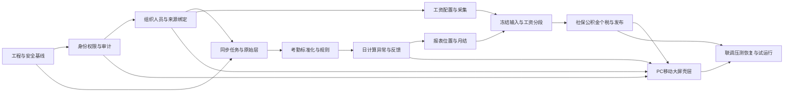

# 分阶段实施计划、依赖与风险

> 基线：PRD V1.7；`docs_confirm` 已于 2026-07-20 人工通过。计划按可验收纵向切片推进，周次为取得必要环境与业务代表后的初始排期，不以牺牲安全门换取日期。

## 1. 交付原则

- 模块化单体优先，依赖方向为 `interfaces → application → domain ← infrastructure`；领域模块不跨表写入。
- 每个切片同时交付迁移、领域/API、权限负测、前端状态、审计、运行说明，不制造“先做完页面再补安全”的债务。
- 外部系统未获批准凭据时使用显式开发适配器和合成契约样本；不得把 mock 结果标成真实联调完成。
- 工资模块只有在组织历史、考勤月结、权限隔离、审计链和冻结快照稳定后进入发布链路。
- 生产环境使用 Ubuntu + Nginx + systemd + MySQL 原生部署；开发阶段也不依赖 Docker、Redis 或消息队列。

## 2. 依赖 DAG

## 3. 阶段计划

| 阶段 | 建议周次 | 主要输出 | 退出条件 |
|---|---:|---|---|
| 0. 文档与工程基线 | 第 1 周 | 技术栈统一；Maven/React 工程；OpenAPI、迁移、配置、日志、测试和许可证门 | 前后端构建通过；无密钥；开发环境可按说明启动 |
| 1. 权限、审计、组织人员 | 第 2–4 周 | 会话主体/能力契约；默认拒绝策略骨架；组织身份/版本/投影；员工与来源绑定；冲突案例；审计事件 | DATA-01–08、AUTH-01–03、AUDIT-01 自动化通过 |
| 2. 接入与任务中心 | 第 4–6 周 | 持久化任务状态机、租约、幂等、Outbox；致远标准/自建表端口；得力适配器；原始层和水位 | SYNC-01–08；OA 写权限数据库层拒绝 |
| 3. 考勤规则与日计算 | 第 6–9 周 | 班次/规则版本；标准化；证据链；日计算；异常与反馈；补卡/假勤关联 | ATT-01–06；PRD 规则夹具与重算差异通过 |
| 4. 报表、位置与月结 | 第 9–11 周 | 日/月报和穿透；受控地图；年假制度；月结预检/关闭/重开/重算 | LOC-01–02、CLOSE-01–03；冻结结果不可改写 |
| 5. 工资采集与配置 | 第 10–12 周 | 受控 Excel；工资项目/方案；社保公积金个税政策版本；输入校验和锁定 | PAY-01–02；危险文件和未授权字段失败关闭 |
| 6. 工资核算与发布 | 第 12–15 周 | 分段、成本、法定计算、差异、复核发布、补发补扣、工资条 | PAY-03–08、PAYSEC-01–04；职责分离全绿 |
| 7. 三端闭合与硬化 | 第 14–16 周 | PC 高频工作台、移动自助、大屏聚合；可访问性；性能、安全、SBOM | UI-01–05、PERF-01–02、SEC-01–02 |
| 8. 联调与上线准备 | 第 16–18 周 | 真实批准环境联调、恢复演练、运维手册、培训、双月结演练、上线评审 | OPS-01–02；高危清零；业务签收和回滚演练通过 |

## 4. 当前首阶段执行包

本次进入阶段 0/1，范围固定为：

1. 建立 `backend` 模块化单体和 `frontend` SPA 骨架，统一 `/api/v1` 契约、关联 ID、健康检查和环境配置。
2. 建立 MySQL 首版迁移：组织身份/版本/当前投影、员工、来源绑定、权限主体与 capability、审计事件；外部 ID 全部 `varchar`。
3. 后端实现组织树只读查询和本人 capability 查询的纵向切片；控制器只做协议转换，应用服务负责用例，MyBatis 仓储负责持久化。
4. 前端实现产品壳层、能力驱动导航、组织页面的加载/空/错误/无权状态；调用真实后端路由，不造业务指标。
5. 单元/集成测试覆盖外部精确 ID、有效期、默认拒绝、字段最小化和迁移约束。

不在首阶段范围：真实 OA/得力连接、考勤规则计算、工资计算、生产 Logo、生产部署和任何真实员工/工资数据。

## 5. 质量门

每个阶段必须同时通过：格式/静态检查、类型检查、单元测试、数据库迁移验证、API 契约测试、安全负测、依赖漏洞/许可证扫描。进入预发布前追加真实 MySQL 集成测试、前后端 E2E、性能、备份恢复和迁移回滚；进入生产前追加独立渗透测试与双人发布审批。

## 6. 风险清单

| ID | 风险 | 概率/影响 | 预防与缓解 | 关闭证据 |
|---|---|---|---|---|
| R-01 | 致远自建表字段或版本漂移 | 高/高 | 版本化 `OAQueryMappingProfile`、只读 allowlist、字段指纹 | 脱敏联调样本和映射回滚通过 |
| R-02 | 得力游标、限流或重复数据导致缺失/重复 | 中/高 | 原样水位、页事务、唯一键、重试与人工重跑 | 崩溃/重放/乱序契约测试通过 |
| R-03 | 工号冲突造成跨员工错误归属 | 中/极高 | 不可变内部 ID、冲突停机、人工核验、历史绑定 | DATA-02–04 及生产前抽样签收 |
| R-04 | 组织变更改写历史考勤/工资 | 中/极高 | 身份/版本/绑定/任职/投影分层、时态查询 | 跨调动日和拆并回归通过 |
| R-05 | 权限旁路泄漏工资或位置 | 中/极高 | 默认拒绝、独立 PAYROLL 域、通道复算、字段省略 | 角色×范围×通道负测与渗透复测 |
| R-06 | MySQL 同时承担任务与在线查询产生资源争用 | 中/高 | 独立线程池/连接配额、短事务、索引与归档、容量压测 | 代表规模 PERF-01/02 通过 |
| R-07 | 社保、公积金、个税政策输入不完整 | 高/高 | 政策版本、期初累计和业务签字；缺失时阻断发布 | 连续月份控制数和边界用例签收 |
| R-08 | 无容器部署导致环境漂移 | 中/中 | 固定 OS/JDK/Node/MySQL 版本、幂等安装脚本、产物校验和 | 预发布从空机重复安装与回滚通过 |
| R-09 | 开源许可证或开发工具授权不符合客户要求 | 中/高 | 许可证白名单、SBOM、`THIRD-PARTY-NOTICES`、正版 IDE 记录 | 法务/客户合规清单签收 |
| R-10 | 备份存在但无法在目标时间恢复 | 中/极高 | 全量+binlog、异地不可变副本、季度恢复演练 | OPS-01 实际 RPO/RTO 记录 |

## 7. 人员与节奏前提

18 周估算以产品 1、UI/交互 1、前端 2、后端 3、QA 2，以及安全/DevOps/薪酬业务代表按阶段参与为前提。若团队人数、真实数据规模或外部联调窗口变化，以依赖 DAG 重排并更新风险，不静默压缩安全、权限和工资验收范围。
