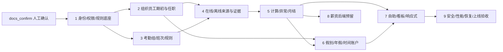

# V1.9 纵向切片实施波次、依赖与回滚点

## 1. 当前门

本轮只完成文档重基线并停在 `docs_confirm`。人工确认前，所有实现波次状态均为 `NOT_AUTHORIZED`。

每个波次单独授权，且必须同时完成：OpenAPI → V3+ 迁移 → 后端/权限 → 前端真实状态 → 自动化测试 → 说明与实际构建。任何一项缺失都不算完成。

本机 MySQL 已获得后续实施阶段的连接授权，但该授权不自动授权任何实现波次。当前没有建库、账号、迁移或联调结果，状态为 `LOCAL_MYSQL_VALIDATION=NOT_RUN`；执行合同见 `../docs-confirm-v1.9/03-local-mysql-development-and-test-plan.md`。

## 2. 依赖 DAG

图中的 `docs_confirm → W1` 只表示依赖前置，不表示确认文档即授权实现；W1 以及后续每一波都必须另行获得明确授权。

W8 是默认关闭的 P0-B 可选支线，不是考勤 P0-A 的 W9 前置；若单独授权 W8，其自身仍须经过同级安全、MySQL、恢复和上线验收，但不得延迟考勤 P0-A 验收或发布决策。

## 3. 波次

| 波次 | 可运行纵向切片 | 前置 | 机械验收 | 回滚点 |
|---|---|---|---|---|
| 1 | 本地账号密码、session、权限域、版本化规则底座 | docs_confirm | 登录/锁定/首次改密/撤权；规则草稿→发布；OpenAPI、V3/V4、前后端测试与构建 | 回到 V2 应用；新表保留，禁用 route/feature |
| 2 | 组织/员工 Excel 期初导入、本地维护、任职周期、累计工龄 | 1 | 模板→预检→差异→发布→本地组织；重复发布不重复；再入职保留历史 | 发布前可丢弃草稿；发布后只冲正/新版本 |
| 3 | 考勤组、季节班次、日历、地点、餐扣、宽限、单边缺卡 | 1 | 规则配置/试算/发布；边界用例全绿；无城市/个人硬编码 | 停用新版本并重新发布上一快照 |
| 4 | 得力、离线异构 Excel、OA 单据只读接入和统一证据 | 2、3 | 三来源进入同一 raw→effective 流；跨来源幂等；错误报告/部分成功/权限 | 停止 source job；批次冲正，不删 raw fact |
| 5 | 考勤计算、异常、补正、跨日、重算、月结/反月结 | 4 | 工作段级结果、解释链、差异版本、冻结保护；金标准案例 | 停止新计算版本；恢复前一 close snapshot |
| 6 | 假别、周年年假、时间账户、期初余额与报表 | 2、5 | 资格/档位分离、周年边界、闰日/再入职；余额=流水重算 | 冲正流水；停用新策略版本 |
| 7 | 员工自助、管理看板、Open Design 收敛与响应式 | 5、6 | 真实 API；loading/empty/error/403/frozen；preview_confirm 多断点 | route/feature 关闭，后端数据不删除 |
| 8 | 默认关闭且前台不可发现的薪资后端预留 | 5 | PAYROLL 默认拒绝；只读冻结快照；前端发现性扫描为 0 | feature flag 关闭、拒绝所有普通调用 |
| 9 | 考勤 P0-A 安全、性能、备份恢复和上线验收 | 7；不依赖 8 | 威胁测试、容量、MySQL、Nginx、恢复演练、P0-A 未决条件关闭 | 不发布；保留上一可部署版本和数据快照 |

## 4. 每波固定执行序列

1. 重新读取本波授权和受影响 V1.9 规格。
2. QA 先写会失败的合同/领域/权限/边界测试。
3. 冻结本波 OpenAPI、错误码、状态机和迁移。
4. 实现后端事务、权限、审计和真实持久化。
5. 实现前端真实 route 和全部异步状态。
6. 在本机 `shenzhou_hr_test` 验证空库 V1→当前、V1/V2→当前、`flyway validate`、二次 migrate no-op、约束、索引和权限负向路径。
7. Spring Boot 使用非 root 应用账号连接 `shenzhou_hr_dev`，后端 API 真实读写 MySQL；前端普通开发模式经 `/api` 验证真实数据和完整状态。
8. 运行前端 `npm run check`、后端 `./mvnw test` 和本波数据库/契约测试。
9. 在浏览器人工验证真实入口；涉及 UI 的波次执行截图/键盘/响应式。
10. 报告真实改动、迁移、命令、MySQL 版本、表/索引、测试数量、结果和测试库结束状态；停止等待下一波授权。

## 5. 横切门禁

- V1/V2 checksum 不变；只允许新 V3+。
- 任何公共 API/route/依赖/新源文件必须属于当前波次授权。
- 本机数据库只允许 `shenzhou_hr_dev` 和 `shenzhou_hr_test`；不接生产数据库、致远或得力。无外部凭据时使用显式开发适配器/契约桩。
- 不使用 Docker、Docker Compose、Podman 或 Testcontainers；H2 不能替代本机 MySQL 验证。
- root 仅用于本机管理控制面；Spring Boot 使用最小权限应用账号，迁移账号与运行账号分离，凭据只在仓库外保存且不得回显。
- 不写真实员工、位置、假因、工资或凭据。
- 前端 PAYROLL 发现性持续为 0。
- 原型 localStorage、demo ID、静态 HTML/JS 和 `data-prototype-unwired` 不进入生产。
- 未执行验证保持 `NOT_VERIFIED`。

## 6. 风险与缓解

| 风险 | 影响 | 缓解 |
|---|---|---|
| 外部字段/撤销语义未冻结 | 真实 OA/得力联调延迟 | 先锁内部规范事件与端口；样本到位后只新增适配映射 |
| Excel 供应商差异大 | 映射错误或重复 | 保存 mapping version、raw row、稳定指纹和错误报告 |
| 时间/跨日/闰日边界 | 计算错误 | 业务时区、工作段、金标准和属性测试 |
| 规则版本影响冻结结果 | 历史被改写 | 规则快照、close snapshot、重开版本和差异审计 |
| 权限维度复杂 | 越权与数据闪现 | 服务端集中授权 + SQL scope + 字段策略 + route guard |
| H2、本机版本与 MySQL 8.4 差异 | 迁移/锁/索引问题 | 每波直接验证本机 MySQL，上线前在 MySQL 8.4 LTS 全量复验，不以 H2 代替 |

## 7. 非阻塞的外部验证条件

真实 OA/得力样本与凭据、异构设备样本、MySQL 8.4 LTS 发布环境、文件存储/病毒扫描和 Open Design 像素截图均不阻塞本轮 `docs_confirm`，但会阻塞相应“真实外部联调通过”或“可生产上线”的声明。本机 MySQL 不再作为缺少授权的外部条件，但在实际执行前仍为 `NOT_RUN`，并阻塞任何“本机数据库联调通过”声明。
