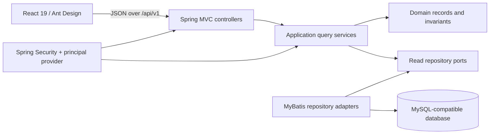

# 神州 HR V1.9 架构与 API 合同

## 状态与范围

本文是当前磁盘实现的可审查合同，不把 Open Design 原型或 demo fallback 误报为生产能力。当前真实后端交付范围只有“当前主体能力、组织当前投影、人员摘要分页”三个只读接口；考勤、薪资、导入、外部系统联调与生产 SSO 仍不在本合同的已实现范围内。

API 的规范来源是 `api/openapi.yaml`。本文为 UmaDev 的架构黑板提供分层、接口、安全和源码证据，任何冲突以 OpenAPI 与可执行测试为准。

## 系统结构



数据与控制流保持单向：`interfaces -> application -> domain`；持久化适配器由 `infrastructure` 实现 `application` 端口。Controller 只做 HTTP 映射，权限、参数边界和可见数据范围在 application / repository 查询链中执行。

## 分层合同

| 目录 | 层 | 允许依赖 |
|---|---|---|
| `backend/src/main/java/com/szsemicon/hr/*/interfaces/rest/` | interfaces | application、domain、shared web |
| `backend/src/main/java/com/szsemicon/hr/*/application/` | application | domain、application ports、shared security |
| `backend/src/main/java/com/szsemicon/hr/*/domain/` | domain | JDK |
| `backend/src/main/java/com/szsemicon/hr/*/infrastructure/persistence/` | infrastructure | application ports、domain、MyBatis |
| `backend/src/main/java/com/szsemicon/hr/shared/` | shared | Spring/JDK，不依赖业务 feature |
| `frontend/src/features/` | frontend feature | shared API/components/i18n |
| `frontend/src/shared/` | frontend shared | React/Ant Design，不依赖 feature |

一方向链：`interfaces -> application -> domain`。

LAYER-RULE: domain !-> application
LAYER-RULE: domain !-> infrastructure
LAYER-RULE: application !-> interfaces
LAYER-RULE: infrastructure !-> interfaces
LAYER-RULE: shared !-> feature

机械约束由 `backend/src/test/java/com/szsemicon/hr/architecture/LayerDependencyTest.java` 和 `MyBatisMapperContractTest.java` 验证。

## API surface

统一前缀：`/api/v1`。生产请求使用 `SHENZHOUHR_SESSION` cookie；开发身份头只在显式启用的 development 配置中生效，不属于公开 API。

| Method | Path | Controller | 权限 / 数据范围 | 成功响应 | 主要错误 |
|---|---|---|---|---|---|
| GET | `/api/v1/me/capabilities` | `MeController.capabilities` | 已认证当前主体；仅返回其有效能力与服务端菜单 | `200 CurrentCapabilities`，`Cache-Control: no-store` | `401 ApiError` |
| GET | `/api/v1/organization-units` | `OrganizationController.currentTree` | `MASTER_DATA:READ`；按主体组织授权范围过滤 | `200 OrganizationNode[]`，`Cache-Control: no-store` | `401/404 ApiError` |
| GET | `/api/v1/employees` | `EmployeeController.list` | `MASTER_DATA:READ`；按主体组织授权范围过滤；`page >= 0`，`1 <= size <= 100` | `200 EmployeePage`，`Cache-Control: no-store` | `400/401/404 ApiError` |

所有外部精确 ID 在 JSON 和 JavaScript 中保持 `string`，不得转换为 `Number`。错误体合同为 `code`、`message`、`correlationId`、`retryable`。

## 数据模型

- `auth_principal`、`auth_role`、`auth_capability`、角色能力和数据范围表组成当前授权目录。
- `organization_unit` 与 `organization_version` 保存组织身份和时态版本；`organization_current_projection`、`organization_current_closure` 提供当前投影与后代范围查询。
- `employee`、`employment_assignment`、`employee_source_binding` 保存人员摘要、任职有效期和外部来源绑定。
- Flyway 迁移位于 `backend/src/main/resources/db/migration/`；开发种子数据单独位于 `db/dev/`，不进入生产迁移位置。

## 安全、错误与查询边界

- `SecurityConfiguration` 只放行健康检查，其余请求必须认证；未认证返回 401，拒绝访问统一返回 404，避免对象存在性泄露。
- `CurrentCapabilityService.require` 在 application 层执行动作权限；组织与人员仓储查询同时绑定 `principalId`、`capabilityCode` 和有效时间，执行对象级数据范围过滤。
- MyBatis XML 使用 `#{...}` 参数绑定，不拼接用户 SQL；人员分页大小上限为 100，offset 使用 `Math.multiplyExact`，查询有稳定排序。
- `CorrelationIdFilter` 将关联标识带入统一错误响应；错误和成功响应均禁用缓存。
- `DevelopmentPrincipalFilter` 只有 `shenzhouhr.development-principal.enabled=true` 时存在，并且只接受与 `SHENZHOUHR_DEV_PRINCIPAL_ID` 完全匹配的规范 UUID。
- 数据库凭据只从 `SHENZHOUHR_DB_URL`、`SHENZHOUHR_DB_USERNAME`、`SHENZHOUHR_DB_PASSWORD` 注入；本文不记录其值。

## 可审查实现证据

| 关注点 | 真实源码 |
|---|---|
| HTTP 路由与 DTO 映射 | `backend/src/main/java/com/szsemicon/hr/authorization/interfaces/rest/MeController.java`；`backend/src/main/java/com/szsemicon/hr/organization/interfaces/rest/OrganizationController.java`；`backend/src/main/java/com/szsemicon/hr/employee/interfaces/rest/EmployeeController.java` |
| 权限与参数边界 | `backend/src/main/java/com/szsemicon/hr/authorization/application/CurrentCapabilityService.java`；`backend/src/main/java/com/szsemicon/hr/organization/application/CurrentOrganizationQueryService.java`；`backend/src/main/java/com/szsemicon/hr/employee/application/EmployeeListQueryService.java` |
| 对象级范围与有界查询 | `backend/src/main/resources/mappers/OrganizationReadMapper.xml`；`backend/src/main/resources/mappers/EmployeeReadMapper.xml`；`backend/src/main/resources/mappers/CapabilityMapper.xml` |
| 认证与错误处理 | `backend/src/main/java/com/szsemicon/hr/shared/security/SecurityConfiguration.java`；`backend/src/main/java/com/szsemicon/hr/shared/security/DevelopmentPrincipalFilter.java`；`backend/src/main/java/com/szsemicon/hr/shared/web/ApiExceptionHandler.java` |
| 前端真实接口调用 | `frontend/src/features/session/sessionApi.ts`；`frontend/src/features/organization/organizationApi.ts`；`frontend/src/features/employee/employeeApi.ts` |
| 契约来源 | `api/openapi.yaml` |

关键执行链的源码事实：

```java
// EmployeeListQueryService.query
if (page < 0 || size < 1 || size > MAX_PAGE_SIZE) {
    throw new IllegalArgumentException("page must be non-negative and size must be between 1 and 100");
}
capabilityService.require(CapabilityCodes.MASTER_DATA_READ);
return repository.findVisibleTo(
        principalProvider.currentPrincipalId(),
        CapabilityCodes.MASTER_DATA_READ,
        clock.instant(),
        page,
        size);
```

```xml
<!-- EmployeeReadMapper.xml -->
WHERE <include refid="visibilityPredicate"/>
ORDER BY employee.display_name, employee.employee_id
LIMIT #{limit} OFFSET #{offset}
```

```java
// SecurityConfiguration.securityFilterChain
http.authorizeHttpRequests(authorize -> authorize
        .requestMatchers("/actuator/health", "/actuator/health/**").permitAll()
        .anyRequest().authenticated());
```

## 技术选择

- 前端：React 19、TypeScript、Vite、Ant Design；浏览器只经统一 `requestJson` 调用公开合同。
- 后端：Java 21、Spring Boot、Spring Security、MyBatis、Flyway；Controller → application service → repository port / domain。
- 数据库：当前 JDBC/Flyway 方言面向 MySQL-compatible 数据库，驱动为 MariaDB Connector/J。真实 MySQL 8.4 运行验证仍受外部实例与凭据条件阻塞，不能据本地 H2/单元测试宣称已完成。
- 可观测性：Micrometer Prometheus、关联 ID、受限 actuator 暴露。

## 生产边界

生产 SSO 协议、真实 MySQL 8.4 联调、致远/得力联调和生产文件存储仍以 `docs/decisions/OPEN-DECISIONS.md` 为准。开发 profile 和前端 demo mode 都不能作为生产数据或生产认证证据。
